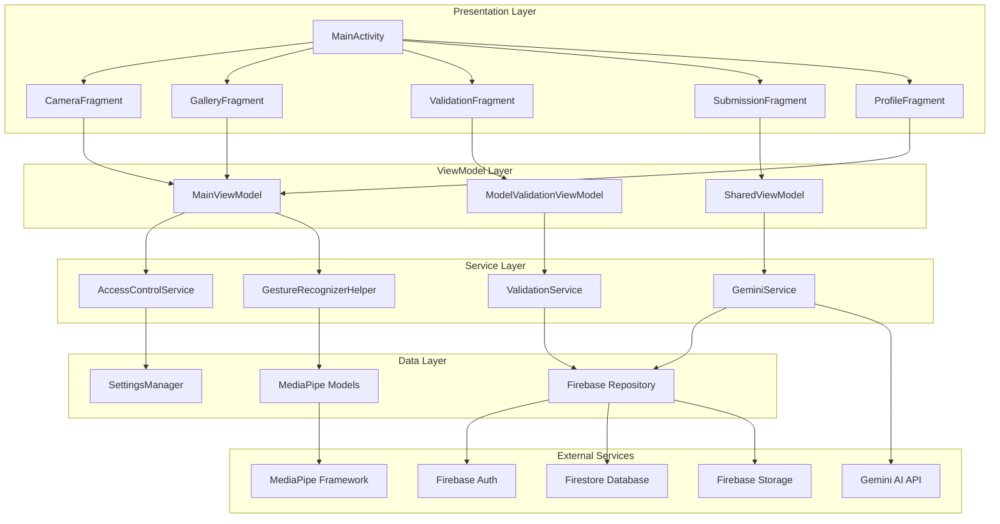

# KSL (Kenyan Sign Language) Translator

<div align="center">

[//]: # (![KSL Translator Demo]&#40;gesturerec.gif&#41;)

**A real-time sign language recognition and translation application powered by MediaPipe and Firebase**

[](https://developer.android.com/)
[](https://kotlinlang.org/)
[](https://firebase.google.com/)
[](https://mediapipe.dev/)
[](LICENSE)

</div>

## 📖 Table of Contents

- [Overview](#overview)
- [Features](#features)
- [Architecture](#architecture)
- [User Roles](#user-roles)
- [Getting Started](#getting-started)
- [Installation](#installation)
- [Configuration](#configuration)
- [Usage](#usage)
- [Development](#development)
- [API Documentation](#api-documentation)
- [Contributing](#contributing)
- [License](#license)
- [Support](#support)

## 🎯 Overview

The KSL Translator is a sophisticated Android application designed to bridge communication gaps by providing real-time Kenyan Sign Language recognition and translation. Built with modern Android architecture patterns and powered by Google's MediaPipe framework, the app serves multiple user types with role-based access control.

### Key Capabilities

- **Real-time Recognition**: Live camera feed processing with 30+ FPS performance
- **Multi-role Architecture**: Three distinct user types with different permissions
- **Cloud Integration**: Firebase backend for authentication, storage, and data synchronization
- **AI-Powered**: MediaPipe ML models with Gemini AI integration for enhanced accuracy
- **Offline Support**: Local model caching for recognition without internet connectivity
- **Data Contribution**: Community-driven model improvement through user submissions

## ✨ Features

### 🏠 Home (Live Recognition)
- Real-time sign language detection using device camera
- Instant translation with confidence scoring
- Performance metrics and usage analytics
- Gesture overlay visualization with hand landmarks
- Support for continuous recognition sessions

### 🖼️ Gallery Management
- Save and organize recognized sign language videos/images
- Cloud synchronization across devices
- Metadata management with timestamps and descriptions
- Batch operations for media management
- Offline viewing capabilities

### ✅ Model Validation
- Comprehensive model accuracy testing (Validator/Developer roles)
- Performance benchmarking and metrics collection
- Validation history tracking and reporting
- A/B testing framework for model comparison
- Detailed analytics dashboard

### 📤 Data Submission
- Community contribution system for training data
- Quality validation pipeline for submitted content
- Progress tracking for submission status
- Batch upload capabilities for multiple files
- Reviewer assignment and feedback system

### 👤 Profile & Authentication
- Secure user authentication with Firebase Auth
- Role-based access control (Signer/Developer/Validator)
- Profile management and customization
- Security settings including two-factor authentication
- Usage statistics and activity history

## 🏗️ Architecture

The application follows **MVVM (Model-View-ViewModel)** architecture with **Repository pattern** for clean separation of concerns.



### Core Components

#### Activities & Fragments
- **MainActivity**: Navigation hub with bottom navigation and toolbar management
- **LoginActivity/RegisterActivity**: Authentication flow management
- **14 Specialized Fragments**: Each handling specific features (Camera, Gallery, Validation, etc.)

#### Services
- **AccessControlService**: Role-based permission management
- **ValidationService**: Model accuracy testing and validation
- **GeminiService**: AI integration for enhanced recognition
- **GestureRecognizerHelper**: MediaPipe integration and ML processing

#### Data Models
- **User**: User profile with role-based permissions
- **TrainingImage**: Training data structure for model improvement
- **ValidationRecord**: Model validation results and metrics
- **UserRole**: Enum defining Signer/Developer/Validator permissions

## 👥 User Roles

### 🙋 Signer (End User)
**Primary Role**: Use the app for sign language translation

**Permissions**:
- ✅ Real-time sign language recognition
- ✅ Gallery management (personal content)
- ✅ Profile management
- ✅ Basic data submission

**Key Features**:
- Live camera translation
- Personal media gallery
- Usage statistics
- Community contributions

### 👨‍💻 Developer
**Primary Role**: Maintain and improve ML models and app functionality

**Permissions**:
- ✅ All Signer permissions
- ✅ Model validation tools
- ✅ Advanced data submission
- ✅ Performance analytics
- ✅ Model deployment controls

**Key Features**:
- Model performance monitoring
- Advanced validation tools
- Data quality assessment
- Development analytics dashboard

### 🔍 Validator
**Primary Role**: Quality assurance for ML model accuracy

**Permissions**:
- ✅ All Signer permissions
- ✅ Model validation access
- ✅ Validation history review
- ✅ Quality metrics dashboard

**Key Features**:
- Comprehensive model testing
- Accuracy assessment tools
- Validation reporting
- Quality control metrics

## 🚀 Getting Started

### Prerequisites

- **Android Studio**: Arctic Fox (2020.3.1) or later
- **Android SDK**: API level 24 (Android 7.0) or higher
- **Java**: JDK 17 or later
- **Kotlin**: 1.8.0 or later
- **Firebase Project**: With Authentication, Firestore, and Storage enabled
- **Google Services**: google-services.json configuration file

### System Requirements

- **Minimum Android Version**: API 24 (Android 7.0)
- **Target Android Version**: API 35 (Android 14)
- **RAM**: 4GB+ recommended for optimal performance
- **Storage**: 1GB free space for models and cache
- **Camera**: Rear camera required for recognition features
- **Network**: Internet connection for cloud features

## 📱 Installation

### 1. Clone the Repository

```bash
git clone https://github.com/yourusername/ksl-translator.git
cd ksl-translator/android
```

### 2. Configure Firebase

1. Create a new Firebase project at [Firebase Console](https://console.firebase.google.com/)
2. Enable Authentication (Email/Password provider)
3. Set up Firestore Database with the following collections:
   ```
   users/
   MODEL_VALIDATIONS/
   training_submissions/
   ```
4. Configure Firebase Storage for media uploads
5. Download `google-services.json` and place it in `app/` directory

### 3. Configure API Keys

Create `local.properties` file in the root directory:

```properties
# Firebase configuration (automatically added by google-services.json)
# Gemini AI API Key
GEMINI_API_KEY=your_gemini_api_key_here
```

### 4. Build and Run

```bash
# Clean and build the project
./gradlew clean build

# Install on connected device/emulator
./gradlew installDebug

# Run tests
./gradlew test
```

## ⚙️ Configuration

### Firebase Setup

#### Firestore Security Rules
```javascript
rules_version = '2';
service cloud.firestore {
  match /databases/{database}/documents {
    // Users can read/write their own data
    match /users/{userId} {
      allow read, write: if request.auth != null && request.auth.uid == userId;
    }
    
    // Model validations (Developer/Validator only)
    match /MODEL_VALIDATIONS/{document} {
      allow read: if request.auth != null;
      allow write: if request.auth != null && 
        resource.data.role in ['DEVELOPER', 'VALIDATOR'];
    }
    
    // Training submissions (authenticated users)
    match /training_submissions/{document} {
      allow read, write: if request.auth != null;
    }
  }
}
```

#### Firebase Storage Rules
```javascript
rules_version = '2';
service firebase.storage {
  match /b/{bucket}/o {
    // User uploads
    match /users/{userId}/{allPaths=**} {
      allow read, write: if request.auth != null && request.auth.uid == userId;
    }
    
    // Training data
    match /training_data/{allPaths=**} {
      allow read: if request.auth != null;
      allow write: if request.auth != null;
    }
    
    // ML Models (read-only for most users)
    match /models/{allPaths=**} {
      allow read: if request.auth != null;
      allow write: if request.auth != null && 
        resource.metadata.role in ['DEVELOPER'];
    }
  }
}
```

### MediaPipe Model Configuration

The app automatically downloads required MediaPipe models on first launch. Models are cached locally for offline usage.

**Default Models**:
- Hand Gesture Recognition: `gesture_recognizer.task`
- Hand Landmark Detection: `hand_landmarker.task`

**Custom Model Integration**:
1. Place custom `.task` files in `app/src/main/assets/`
2. Update `download_tasks.gradle` with new model URLs
3. Modify `GestureRecognizerHelper.kt` to load custom models

## 📚 Usage

### Basic Recognition Flow

1. **Launch App**: Open the KSL Translator app
2. **Authenticate**: Sign in with your account (or create new account)
3. **Start Recognition**: Navigate to Home tab and tap camera button
4. **Perform Signs**: Position hands in front of camera
5. **View Translation**: Real-time translation appears on screen
6. **Save Results**: Tap save button to store in gallery

### Advanced Features

#### Model Validation (Developer/Validator)
```kotlin
// Example validation workflow
val validationService = ValidationService()
val results = validationService.runModelValidation(testDataset)
val accuracy = results.calculateAccuracy()
validationService.saveValidationRecord(userId, accuracy, results)
```

#### Data Submission
```kotlin
// Submit training data
val submissionData = TrainingSubmission(
    userId = currentUser.uid,
    mediaUrl = uploadedFileUrl,
    signLabel = "hello",
    description = "Greeting gesture"
)
dataSubmissionService.submitTrainingData(submissionData)
```

## 🛠️ Development

### Project Structure

```
app/src/main/java/com/jerry/ksl/gesturerecognizer/
├── MainActivity.kt                 # Main navigation activity
├── LoginActivity.kt               # Authentication flow
├── RegisterActivity.kt            # User registration
├── MainViewModel.kt               # Main app state management
├── SharedViewModel.kt             # Shared state between fragments
├── ModelValidationViewModel.kt    # Validation features
├── SettingsManager.kt             # App settings and preferences
├── GestureRecognizerHelper.kt     # MediaPipe ML integration
├── OverlayView.kt                 # Recognition result overlay
├── fragment/                      # All UI fragments
│   ├── CameraFragment.kt         # Live recognition UI
│   ├── GalleryFragment.kt        # Media gallery management
│   ├── ModelValidationFragment.kt # Model testing tools
│   ├── SubmitTrainingDataFragment.kt # Data submission
│   └── ...                       # Additional fragments
├── service/                       # Business logic services
│   ├── AccessControlService.kt   # Role-based permissions
│   ├── ValidationService.kt      # Model validation
│   └── GeminiService.kt          # AI integration
├── model/                         # Data models
│   ├── User.kt                   # User profile model
│   ├── UserRole.kt               # Role enumeration
│   ├── TrainingImage.kt          # Training data model
│   └── ValidationRecord.kt       # Validation results
├── adapter/                       # RecyclerView adapters
│   ├── SubmissionHistoryAdapter.kt
│   └── ValidationHistoryAdapter.kt
└── interfaces/                    # Interface definitions
    └── RecognitionClearable.kt   # Recognition state management
```

### Key Dependencies

```gradle
// Core Android
implementation 'androidx.core:core-ktx:1.8.0'
implementation 'androidx.appcompat:appcompat:1.5.1'
implementation 'com.google.android.material:material:1.7.0'

// Navigation
implementation "androidx.navigation:navigation-fragment-ktx:2.5.3"
implementation "androidx.navigation:navigation-ui-ktx:2.5.3"

// Camera
implementation "androidx.camera:camera-core:1.2.0-alpha02"
implementation "androidx.camera:camera-camera2:1.2.0-alpha02"
implementation "androidx.camera:camera-lifecycle:1.2.0-alpha02"
implementation "androidx.camera:camera-view:1.2.0-alpha02"

// ML and AI
implementation 'com.google.mediapipe:tasks-vision:0.10.14'
implementation 'com.google.mediapipe:tasks-genai:0.10.25'
implementation "com.google.ai.client.generativeai:generativeai:0.7.0"

// Firebase
implementation 'com.google.firebase:firebase-auth:22.3.1'
implementation 'com.google.firebase:firebase-storage:20.3.0'
implementation 'com.google.firebase:firebase-firestore:24.10.1'

// Image Loading
implementation 'com.github.bumptech.glide:glide:4.16.0'

// HTTP Client
implementation 'com.squareup.okhttp3:okhttp:4.10.0'
```

### Building Custom Features

#### Adding New User Role

1. **Update UserRole enum**:
```kotlin
enum class UserRole {
    SIGNER,
    DEVELOPER,
    VALIDATOR,
    NEW_ROLE  // Add your new role
}
```

2. **Modify AccessControlService**:

```kotlin
fun hasPermission(user: User, permission: String): Any {
   return when (user.role) {
      UserRole.NEW_ROLE -> when (permission) {
         "new_feature_access" -> true
         else -> false
      }
      // ... existing role checks
      else -> {}
   }
}
```

3. **Update Firestore security rules** to include new role permissions

#### Integrating Custom ML Models

1. **Add model to assets**:
```gradle
// In download_tasks.gradle
task downloadNewModel(type: Download) {
    src 'https://your-model-url.com/new_model.task'
    dest "${ASSET_DIR}/new_model.task"
    overwrite false
}
```

2. **Update GestureRecognizerHelper**:
```kotlin
private fun setupGestureRecognizer() {
    val baseOptionsBuilder = BaseOptions.builder()
        .setModelAssetPath("new_model.task")  // Use your model
        .setDelegate(currentDelegate)
    // ... rest of setup
}
```

### Testing

#### Unit Tests
```bash
# Run all unit tests
./gradlew test

# Run specific test class
./gradlew test --tests="com.jerry.ksl.gesturerecognizer.MainViewModelTest"
```

#### Integration Tests
```bash
# Run instrumented tests
./gradlew connectedAndroidTest

# Run specific test
./gradlew connectedAndroidTest -Pandroid.testInstrumentationRunnerArguments.class=com.jerry.ksl.gesturerecognizer.FirebaseIntegrationTest
```

#### Performance Testing
```bash
# Profile memory usage
./gradlew assembleDebug
adb shell am start -n com.jerry.ksl.gesturerecognizer/.MainActivity
# Use Android Studio Profiler for detailed analysis
```

## 📋 API Documentation

### Firebase Integration

#### Authentication
```kotlin
// Sign in user
suspend fun signInUser(email: String, password: String): Result<User> {
    return try {
        val authResult = FirebaseAuth.getInstance()
            .signInWithEmailAndPassword(email, password).await()
        val user = getUserProfile(authResult.user!!.uid)
        Result.success(user)
    } catch (e: Exception) {
        Result.failure(e)
    }
}
```

#### Firestore Operations
```kotlin
// Save user data
suspend fun saveUserProfile(user: User) {
    FirebaseFirestore.getInstance()
        .collection("users")
        .document(user.uid)
        .set(user)
        .await()
}

// Query validation records
suspend fun getValidationHistory(userId: String): List<ValidationRecord> {
    return FirebaseFirestore.getInstance()
        .collection("MODEL_VALIDATIONS")
        .whereEqualTo("userId", userId)
        .orderBy("timestamp", Query.Direction.DESCENDING)
        .get()
        .await()
        .toObjects(ValidationRecord::class.java)
}
```

#### Storage Operations
```kotlin
// Upload training image
suspend fun uploadTrainingImage(uri: Uri, userId: String): String {
    val storageRef = FirebaseStorage.getInstance()
        .reference
        .child("training_data/$userId/${UUID.randomUUID()}.jpg")
    
    return storageRef.putFile(uri).await()
        .storage.downloadUrl.await().toString()
}
```

### MediaPipe Integration

#### Initialize Gesture Recognizer
```kotlin
private fun setupGestureRecognizer() {
    val baseOptions = BaseOptions.builder()
        .setModelAssetPath(MODEL_PATH)
        .setDelegate(BaseOptions.Delegate.CPU)
        .build()

    val options = GestureRecognizer.GestureRecognizerOptions.builder()
        .setBaseOptions(baseOptions)
        .setMinHandDetectionConfidence(0.5f)
        .setMinHandTrackingConfidence(0.5f)
        .setMinHandPresenceConfidence(0.5f)
        .setNumHands(2)
        .build()

    gestureRecognizer = GestureRecognizer.createFromOptions(context, options)
}
```

#### Process Camera Frame
```kotlin
fun recognizeLiveStream(imageProxy: ImageProxy) {
    val mpImage = BitmapImageBuilder(imageProxy.toBitmap()).build()
    gestureRecognizer?.recognizeAsync(mpImage, imageProxy.imageInfo.timestamp)
}
```

### Gemini AI Integration

```kotlin
class GeminiService {
    private val generativeModel = GenerativeModel(
        modelName = "gemini-pro",
        apiKey = BuildConfig.GEMINI_API_KEY
    )

    suspend fun enhanceRecognition(gestureData: String): String {
        val prompt = "Analyze this sign language gesture data and provide translation: $gestureData"
        return generativeModel.generateContent(prompt).text ?: ""
    }
}
```

## 🔧 Troubleshooting

### Common Issues

#### MediaPipe Model Loading Fails
```
Error: Failed to load gesture recognizer model
```

**Solutions**:
1. Check internet connectivity for model download
2. Verify `download_tasks.gradle` configuration
3. Clear app cache and reinstall
4. Check device storage space (models require ~50MB)

#### Firebase Authentication Issues
```
Error: FirebaseAuthException: The user account has been disabled
```

**Solutions**:
1. Verify Firebase project configuration
2. Check `google-services.json` placement
3. Ensure user account is enabled in Firebase Console
4. Verify SHA fingerprints in Firebase project settings

#### Camera Permission Denied
```
Error: Camera permission required for recognition
```

**Solutions**:
1. Request camera permission in app settings
2. Check `AndroidManifest.xml` permission declarations
3. Verify runtime permission handling in `CameraFragment`

#### Poor Recognition Accuracy
```
Issue: Low confidence scores or incorrect translations
```

**Solutions**:
1. Ensure proper lighting conditions
2. Position hands clearly in camera view
3. Check MediaPipe model version
4. Adjust confidence thresholds in settings
5. Retrain custom models with more data

### Performance Optimization

#### Memory Usage
- Monitor heap usage with Android Studio Profiler
- Implement proper lifecycle management for camera resources
- Use image compression for gallery items
- Clear MediaPipe resources when not in use

#### Battery Optimization
- Reduce camera frame rate when app is in background
- Implement smart model loading (on-demand)
- Use WorkManager for background data synchronization
- Optimize Firebase query patterns

## 🤝 Contributing

We welcome contributions to the KSL Translator project! Please see our [Contributing Guidelines](CONTRIBUTING.md) for details on how to submit pull requests, report issues, and contribute to the project.

### Quick Start for Contributors

1. Fork the repository
2. Create a feature branch (`git checkout -b feature/amazing-feature`)
3. Commit your changes (`git commit -m 'Add amazing feature'`)
4. Push to the branch (`git push origin feature/amazing-feature`)
5. Open a Pull Request

### Development Guidelines

- Follow Kotlin coding conventions
- Write comprehensive tests for new features
- Update documentation for API changes
- Ensure backward compatibility when possible
- Use meaningful commit messages

## 📄 License

This project is licensed under the Apache License 2.0 - see the [LICENSE](LICENSE) file for details.

```
Copyright 2024 KSL Translator Contributors

Licensed under the Apache License, Version 2.0 (the "License");
you may not use this file except in compliance with the License.
You may obtain a copy of the License at

    http://www.apache.org/licenses/LICENSE-2.0

Unless required by applicable law or agreed to in writing, software
distributed under the License is distributed on an "AS IS" BASIS,
WITHOUT WARRANTIES OR CONDITIONS OF ANY KIND, either express or implied.
See the License for the specific language governing permissions and
limitations under the License.
```

## 🆘 Support

### Getting Help

- **Documentation**: Check this README and inline code documentation
- **Issues**: Report bugs and request features via [GitHub Issues](https://github.com/yourusername/ksl-translator/issues)
- **Discussions**: Join community discussions in [GitHub Discussions](https://github.com/yourusername/ksl-translator/discussions)
- **Email**: Contact the maintainers at support@ksltranslator.com

### Frequently Asked Questions

**Q: How accurate is the sign language recognition?**
A: The current model achieves 85%+ accuracy on validation datasets. Accuracy depends on lighting conditions, hand positioning, and gesture complexity.

**Q: Can I use the app offline?**
A: Yes, basic recognition works offline once models are downloaded. Cloud features (gallery sync, data submission) require internet connectivity.

**Q: How can I contribute training data?**
A: Users can submit training data through the Submit Data feature. All submissions go through a validation process before being added to the training dataset.

**Q: What sign languages are supported?**
A: Currently focused on Kenyan Sign Language (KSL). The architecture supports adding additional sign languages through custom model training.

### Acknowledgments

- **MediaPipe Team**: For the powerful ML framework
- **Firebase Team**: For comprehensive backend services
- **KSL Community**: For training data and validation support
- **Contributors**: All developers who have contributed to this project

---

<div align="center">

**Built with ❤️ for the deaf and hard-of-hearing community**

[Website](https://ksltranslator.com) • [Documentation](https://docs.ksltranslator.com) • [Community](https://community.ksltranslator.com)

</div>
