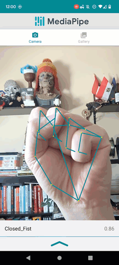
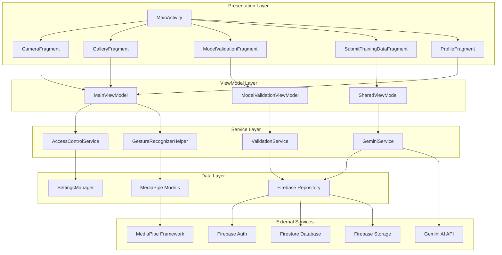

# KSL (Kenyan Sign Language) Translator

<div align="center">



**A real-time sign language recognition and translation application powered by MediaPipe and Firebase**

[](https://developer.android.com/)
[](https://kotlinlang.org/)
[](https://firebase.google.com/)
[](https://mediapipe.dev/)
[](LICENSE)

</div>

## Table of Contents

- [Overview](#overview)
- [Features](#features)
- [Architecture](#architecture)
- [User Roles](#user-roles)
- [Getting Started](#getting-started)
- [Installation](#installation)
- [Configuration](#configuration)
- [Usage](#usage)
- [Development](#development)
- [API Documentation](#api-documentation)
- [Contributing](#contributing)
- [License](#license)
- [Support](#support)

## Overview

The KSL Translator is an Android application designed to bridge communication gaps by providing real-time Kenyan Sign Language recognition and translation. Built with modern Android architecture patterns and powered by Google's MediaPipe framework, the app serves multiple user types with role-based access control.

**Current model accuracy: 76% on a 26-sign KSL test set.** Inference runs fully on-device using a custom-trained MediaPipe gesture recognition model (`ksl_first_model.task`), enabling gesture recognition without an internet connection.

### Key Capabilities

- **Real-time Recognition**: Live camera feed processing at 30+ FPS using MediaPipe
- **On-device ML**: Custom KSL gesture recognition model runs entirely on the device — no cloud calls for inference
- **Natural Language Translation**: Recognised sign sequences are translated to natural language via Gemini AI (requires internet)
- **Multi-role Architecture**: Three distinct user types with different permissions
- **Community Data Pipeline**: Users contribute training images to improve the model
- **Cloud Integration**: Firebase backend for authentication, storage, and data synchronisation

## Features

### Home (Live Recognition)
- Real-time sign language detection using the device camera
- Two modes: **Word Recognition** (accumulates signs as words) and **Live Translation** (converts accumulated words to natural language via Gemini AI)
- Confidence score display per recognised gesture
- Gesture overlay visualisation with hand landmarks
- Text-to-Speech output option

### Gallery Analysis
- Load and analyse videos or images from device storage
- Frame-by-frame inference using `MediaMetadataRetriever`
- Results visualisation for captured media

### Model Validation (Validator / Developer roles)
- Capture validation images against expected sign labels
- Real-time model prediction display with confidence scores and inference time
- Timed capture mode (automatic capture at intervals)
- Validation record storage in Firestore
- Validation history with accuracy metrics per user

### Data Submission (All roles)
- Capture and submit training images with labels for model improvement
- Category-based organisation: Alphabet (A–Z), Numbers (0–9), Common Phrases
- Image quality validation (minimum 224 px, maximum 5 MB, brightness threshold)
- Batch upload support
- Submission history tracking

### Settings & Preferences
- Confidence threshold adjustment (hand detection, tracking, presence)
- Hardware delegate selection (CPU / GPU)
- Camera facing selection (front / back)
- Dark / light theme
- Debug mode toggle

### Profile & Authentication
- Email / password authentication via Firebase Auth
- Role-based access control (Signer / Developer / Validator)
- Profile management and photo upload
- Account security settings (password change)

## Architecture

The application follows **MVVM (Model-View-ViewModel)** architecture with a service layer for clean separation of concerns.



### Core Components

#### Activities & Fragments
- **MainActivity**: Navigation hub with bottom navigation and toolbar management
- **LoginActivity / RegisterActivity**: Authentication flow
- **14 Specialised Fragments**: Camera, Gallery, Validation, Data Submission, Profile, Settings, Account Security, Submission History, Validation History, User Preferences, Permissions, Learn KSL, Training Image Detail, Results

#### Services
- **GestureRecognizerHelper**: Wraps MediaPipe GestureRecognizer; supports LIVE_STREAM, VIDEO, and IMAGE running modes; configurable confidence thresholds
- **GeminiService**: Sends accumulated sign sequences to `gemini-2.5-flash` for natural language translation (internet required)
- **ValidationService**: Firestore queries for MODEL_VALIDATIONS collection
- **AccessControlService**: Role-based permission management backed by Firestore user records

#### Data Models
- **User**: userId, email, role (UserRole), profileImageUrl, createdAt, lastLoginDate, isActive, displayName
- **ValidationRecord**: id, userId, imageUrl, expectedLabel, predictedLabel, confidenceScore, inferenceTimeMs, isCorrect, modelVersion, deviceInfo, timestamp
- **TrainingImageItem**: id, userId, imageUrl, label, validated, modelId, timestamp

## User Roles

### Signer (Default)
**Primary role**: Use the app to recognise and translate KSL

| Permission | Access |
|---|---|
| Live gesture recognition | Yes |
| Gallery analysis | Yes |
| Profile management | Yes |
| Training data submission | Yes |
| Model validation | No |
| User role management | No |

### Validator
**Primary role**: Quality assurance for ML model accuracy

| Permission | Access |
|---|---|
| All Signer permissions | Yes |
| Model validation tools | Yes |
| Validation history | Yes |
| Training data submission | Yes |
| User role management | No |

### Developer
**Primary role**: ML model improvement and app maintenance

| Permission | Access |
|---|---|
| All Validator permissions | Yes |
| User role management | Yes |
| Advanced analytics | Yes |

## Getting Started

### Prerequisites

- **Android Studio**: Giraffe (2022.3.1) or later
- **Android SDK**: API level 24 (Android 7.0) or higher; target API 35
- **JDK**: 17 or later
- **Kotlin**: 2.0.0
- **Firebase Project**: Authentication, Firestore, and Storage enabled
- **Google Services**: `google-services.json` configuration file

### System Requirements

- **Minimum Android Version**: API 24 (Android 7.0)
- **Target Android Version**: API 35 (Android 15)
- **RAM**: 4 GB+ recommended for smooth ML inference
- **Storage**: ~100 MB free (models are ~8 MB each)
- **Camera**: Rear camera required for recognition features
- **Network**: Required for Firebase sync and Gemini translation; gesture recognition itself works offline

## Installation

### 1. Clone the Repository

```bash
git clone https://github.com/jarida-io/kenyan_sign_language_app.git
cd kenyan_sign_language_app
```

### 2. Configure Firebase

1. Create a Firebase project at [Firebase Console](https://console.firebase.google.com/)
2. Enable **Authentication** (Email/Password provider)
3. Set up **Firestore Database** with these collections:
   ```
   users/
   MODEL_VALIDATIONS/
   TRAINING_DATA/
   SUBMISSION_HISTORY/
   ```
4. Enable **Firebase Storage** for training images and profile photos
5. Download `google-services.json` and place it in `app/`

### 3. Set API Key

Add your Gemini API key to `local.properties`:

```properties
GEMINI_API_KEY=your_gemini_api_key_here
```

> Gesture recognition does **not** require an API key — it runs on-device. The Gemini key is only needed for natural language translation.

### 4. Build and Run

```bash
./gradlew clean build
./gradlew installDebug
```

The build task automatically downloads the KSL gesture model (`ksl_first_model.task`) from Firebase Storage.

## Configuration

### Firebase Firestore Security Rules

```javascript
rules_version = '2';
service cloud.firestore {
  match /databases/{database}/documents {
    match /users/{userId} {
      allow read, write: if request.auth != null && request.auth.uid == userId;
    }
    match /MODEL_VALIDATIONS/{document} {
      allow read: if request.auth != null;
      allow write: if request.auth != null;
    }
    match /TRAINING_DATA/{document} {
      allow read, write: if request.auth != null;
    }
    match /SUBMISSION_HISTORY/{document} {
      allow read, write: if request.auth != null;
    }
  }
}
```

### Firebase Storage Rules

```javascript
rules_version = '2';
service firebase.storage {
  match /b/{bucket}/o {
    match /users/{userId}/{allPaths=**} {
      allow read, write: if request.auth != null && request.auth.uid == userId;
    }
    match /training_data/{allPaths=**} {
      allow read: if request.auth != null;
      allow write: if request.auth != null;
    }
  }
}
```

### MediaPipe Model

The app uses two model files in `app/src/main/assets/`:

| File | Size | Purpose |
|---|---|---|
| `ksl_first_model.task` | ~8.1 MB | Custom KSL gesture recognition model |
| `gesture_recognizer.task` | ~8.0 MB | Reference MediaPipe gesture recognizer |

Both run on-device via MediaPipe Tasks Vision API (`com.google.mediapipe:tasks-vision:0.10.14`).

## Usage

### Basic Recognition Flow

1. Launch the app and sign in
2. Navigate to the **Home** tab
3. Point the camera at your hands
4. Perform KSL gestures — recognised signs appear in real time
5. Switch to **Live Translation** mode to convert accumulated signs to a natural language sentence via Gemini AI

### Contributing Training Data

1. Navigate to **Submit Data**
2. Select category (Alphabet, Numbers, or Common Phrases) and the specific sign
3. Capture images — quality checks run automatically
4. Submit for review

### Running Model Validation (Validator / Developer only)

1. Navigate to **Validation**
2. Select the expected sign label
3. Capture validation images
4. Review confidence scores and inference times
5. Check **Validation History** for accuracy trends

## Development

### Project Structure

```
app/src/main/java/com/jerry/ksl/gesturerecognizer/
├── MainActivity.kt
├── LoginActivity.kt
├── RegisterActivity.kt
├── MainViewModel.kt
├── SharedViewModel.kt
├── ModelValidationViewModel.kt
├── SettingsManager.kt
├── GestureRecognizerHelper.kt
├── OverlayView.kt
├── fragment/
│   ├── CameraFragment.kt
│   ├── GalleryFragment.kt
│   ├── ModelValidationFragment.kt
│   ├── SubmitTrainingDataFragment.kt
│   ├── SettingsFragment.kt
│   ├── ProfileFragment.kt
│   ├── AccountSecurityFragment.kt
│   ├── SubmissionHistoryFragment.kt
│   ├── ValidationHistoryFragment.kt
│   ├── UserPreferencesFragment.kt
│   ├── PermissionsFragment.kt
│   ├── LearnKslFragment.kt
│   └── TrainingImageDetailFragment.kt
├── service/
│   ├── AccessControlService.kt
│   ├── ValidationService.kt
│   └── GeminiService.kt
├── model/
│   ├── User.kt
│   ├── UserRole.kt
│   ├── ValidationRecord.kt
│   └── TrainingImageItem.kt
├── adapter/
│   ├── SubmissionHistoryAdapter.kt
│   ├── ValidationHistoryAdapter.kt
│   └── GestureRecognizerResultsAdapter.kt
└── interfaces/
    └── RecognitionClearable.kt
```

### Key Dependencies

```gradle
// Camera
implementation "androidx.camera:camera-core:1.2.0-alpha02"
implementation "androidx.camera:camera-camera2:1.2.0-alpha02"
implementation "androidx.camera:camera-lifecycle:1.2.0-alpha02"
implementation "androidx.camera:camera-view:1.2.0-alpha02"

// ML
implementation 'com.google.mediapipe:tasks-vision:0.10.14'
implementation 'com.google.ai.client.generativeai:generativeai:0.7.0'

// Firebase
implementation 'com.google.firebase:firebase-auth:22.3.1'
implementation 'com.google.firebase:firebase-storage:20.3.0'
implementation 'com.google.firebase:firebase-firestore:24.10.1'

// UI
implementation 'com.intuit.sdp:sdp-android:1.1.1'
implementation 'com.github.bumptech.glide:glide:4.16.0'
```

### Running Tests

```bash
# Unit tests
./gradlew test

# Instrumented tests (requires connected device or emulator)
./gradlew connectedAndroidTest
```

Test assets are in `src/androidTest/assets/`: `hand_thumb_up.jpg`, `test_video.mp4`.

## API Documentation

### GestureRecognizerHelper

```kotlin
// Initialise (call from Fragment.onViewCreated)
gestureRecognizerHelper = GestureRecognizerHelper(
    context = requireContext(),
    runningMode = RunningMode.LIVE_STREAM,
    minHandDetectionConfidence = 1.0f,
    minHandTrackingConfidence = 0.7f,
    minHandPresenceConfidence = 0.7f,
    gestureRecognizerListener = this
)

// Process a camera frame
gestureRecognizerHelper.recognizeLiveStream(imageProxy)
```

### GeminiService

```kotlin
// Translate accumulated sign words to natural language
val geminiService = GeminiService()
val result = geminiService.translateSigns(listOf("Hello", "My", "Name"))
// Returns: "Hello, my name is..."
// Model: gemini-2.5-flash | Temperature: 0.2 | Max tokens: 1000
// Requires internet connection.
```

### AccessControlService

```kotlin
val accessService = AccessControlService()
val user = accessService.getCurrentUser()          // returns User?
val canValidate = accessService.canAccessValidation(user)  // DEVELOPER or VALIDATOR only
val canSubmit = accessService.canSubmitData(user)          // all roles
```

## Contributing

See [CONTRIBUTING.md](CONTRIBUTING.md) for setup instructions, coding standards, and pull request guidelines.

### Priority Contribution Areas

- **Model accuracy**: Contribute KSL training images via the Submit Data feature
- **Sign coverage**: Expand beyond the current 26-sign set
- **Swahili UI translations**: Add localisation for `res/values-sw/`
- **Offline LLM**: Integrate on-device translation (Gemma3 model support in progress)
- **CHW offline module**: Low-connectivity Community Health Worker mode

## Significance for ClimateShield AI

This project demonstrates Jarida's edge AI capability — custom on-device ML inference without cloud dependency for the core recognition task. The same architecture is being applied to ClimateShield AI's offline Community Health Worker module, enabling disease risk assessment in low-connectivity areas across Kenya.

See: [github.com/jarida-io/climateshield-ai](https://github.com/jarida-io/climateshield-ai)

## License

Apache 2.0 — see [LICENSE](LICENSE)

```
Copyright 2024 Jarida Open Source

Licensed under the Apache License, Version 2.0 (the "License");
you may not use this file except in compliance with the License.
You may obtain a copy of the License at

    http://www.apache.org/licenses/LICENSE-2.0
```

## Support

### Frequently Asked Questions

**Q: How accurate is the sign language recognition?**
A: The current custom KSL model achieves **76% accuracy on a 26-sign test set**. Accuracy depends on lighting conditions and hand positioning. We are actively collecting training data to expand sign coverage and improve accuracy.

**Q: Does the app work offline?**
A: **Gesture recognition runs fully on-device** and does not require an internet connection. Natural language translation (converting recognised signs to a sentence) uses the Gemini AI API and requires an internet connection.

**Q: What signs are currently supported?**
A: The model covers 26 KSL signs in the current test set. Training data collection is ongoing to expand coverage.

**Q: How can I contribute training data?**
A: Sign in to the app and use the **Submit Data** feature. All submissions go through quality validation before being added to the training dataset.

**Q: Why Kenyan Sign Language specifically?**
A: KSL is the primary sign language used by the deaf community in Kenya. There are very few technology tools built for KSL specifically. This project is part of Jarida's broader mission to build inclusive, Africa-first technology.

### Getting Help

- **Issues**: [GitHub Issues](https://github.com/jarida-io/kenyan_sign_language_app/issues)
- **Discussions**: [GitHub Discussions](https://github.com/jarida-io/kenyan_sign_language_app/discussions)
- **Email**: hello@jarida.io

---

<div align="center">

**Built with care for the deaf and hard-of-hearing community in Kenya**

[Website](https://jarida.io) | [GitHub](https://github.com/jarida-io)

</div>
